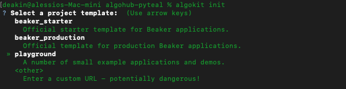
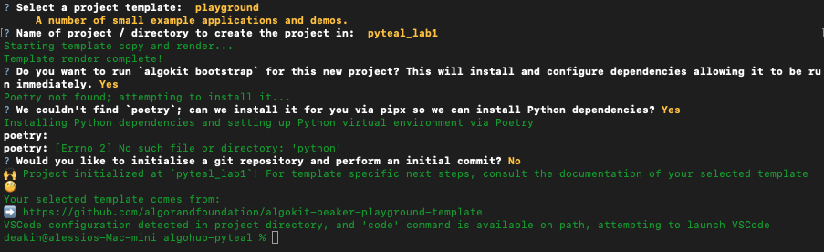
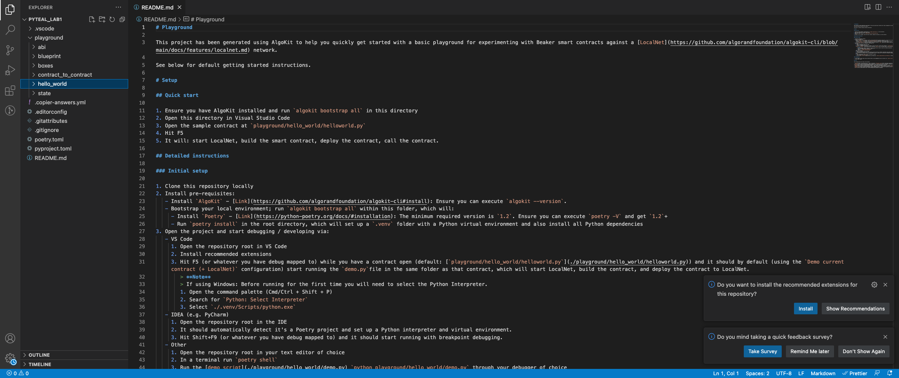
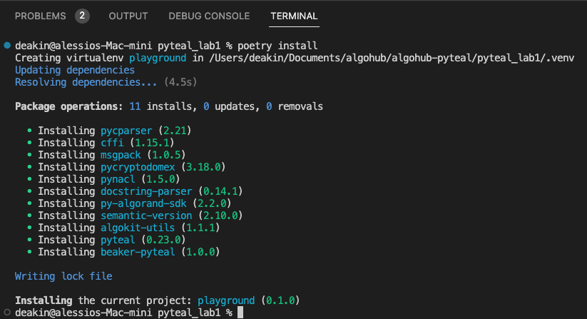
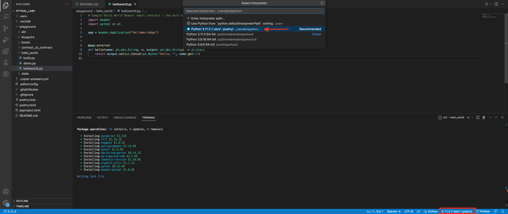

# Experimenting with AlgoKit


Then, we will initialize an AlgoKit project. Initializing an AlgoKit project allows us to:

> - :point_right: Select smart contract template.
> - :point_right: Bootstrap toolchain.
> - :point_right: Compile smart contract source code.

```bash
algokit init
```

We will choose the `playground` option which is the perfect choice for learning and playing around with smart contracts


Following the prompt, we will name our project and allow AlgoKit to setup the smart contract project template


After finishing configuring, the project will be opened in Visual Studio Code


Open the terminal in VS Code, use `poetry` to install dependencies for the project

```bash
poetry install
```



---

Troubleshooting: if you face the error `[Errno 2] No such file or directory: 'python'` on macOS, run the following command and restart the terminal:

```bash
sudo ln -s /opt/homebrew/bin/python3 /opt/homebrew/bin/python
```

---

In VS Code, choose the python interpreter with `'.venv':poetry`


> :exclamation: You may need to close and reopen the terminal to make sure all changes are updated.

:tada: Great! Our playground project is now all set and ready for smart contracts building!

Before next week, feel free to have a look around and an experiment with different parts of the code.

