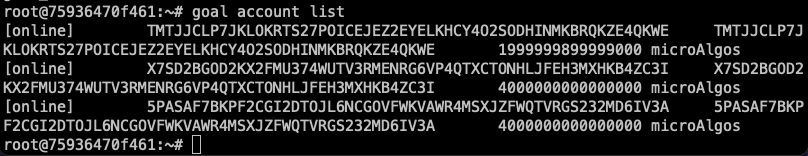

# Lab 1 - Environment setup, creating and sending transactions

Hi everyone! The focus of this first lab is to setup your environment with [AlgoKit](https://developer.algorand.org/algokit/), get get you exposed to sending transactions from the command line.

We will also be touching on using javascript to send a transaction.

These examples will be running on a machine running MacOS, but can also be used with other operating systems.

## Pre-requisites

### MacOS

- **Required**:
  - Git
  - docker 4.10+
  - python 3.10+
  - pipx
- **Recommended**:
  - Homebrew
  - Chrome
  - Visual Studio Code

### Windows

- **Required**:
  - Windows Subsystem for Linux 2 (WSL2)
  - Git
  - docker 4.10+
  - python 3.10+
  - pipx
- **Recommended**:
  - Visual Studio Code

> Follow [this link](https://developer.algorand.org/algokit/) for the detailed tutorial of how to install the prerequites for AlgoKit on both operating systems.

## Environment setup

For this exercise we will be using [AlgoKit](https://developer.algorand.org/algokit/). In our live video we will walk through the setup for MacOS, but the link provided in the previous section above has tips for all environments.

Note: The instructions below assume you have the pre-requisites installed and that you are using the command line (terminal on MacOS/Ubuntu, or WSL2 on Windows).

Open your terminal (WSL2 terminal for Windows), install AlgoKit tool

```bash
# macOS
brew install algorandfoundation/tap/algokit
```

```bash
# Windows
pipx install algokit
```

> :exclamation: After installation, you may need to close and reopen the terminal to use the `algokit` command.

Then, we need to install `poetry` to make sure our process is smooth

```bash
curl -sSL https://install.python-poetry.org | python3 -
```

Make a directory for the course and change directory into it

```bash
mkdir algohub-pyteal
cd algohub-pyteal
```

Now it's time to start our node. Fortunately, AlgoKit has some tooling to help us out.

```bash
algokit localnet start
```

This will pull the latest docker images and start our local network. The first time you run this it may take a few minutes - especially if you don't have fast internet when you run it.

Next, we'll enter into the localnet console.

```bash
algokit localnet console
```
This will log us into the docker instance running the Algorand node software. To see the available accounts we can use the `goal account list` command.

```bash
goal account list
```

You should see something similar to the image below;


So that we can use these addresses easily, copy and paste the script below into your terminal;

```bash
counter=1
for addr in $(algokit goal account list | awk '{print $2}'); do
    export ACCT$counter=$addr
    echo "Set ACCT$counter=$addr"
    ((counter++))
done
```
*Note: This is a dev environment that is just on your machine, so DO NOT send real algos or any assets to these addresses*

To access these accounts later, you can use `$ACCT1, $ACCT2` or `$ACCT3`.

We're ready for the other sections now.

[Creating and transferring assets](Assets.md)

[Experiment with AlgoKit](Experiment.md)