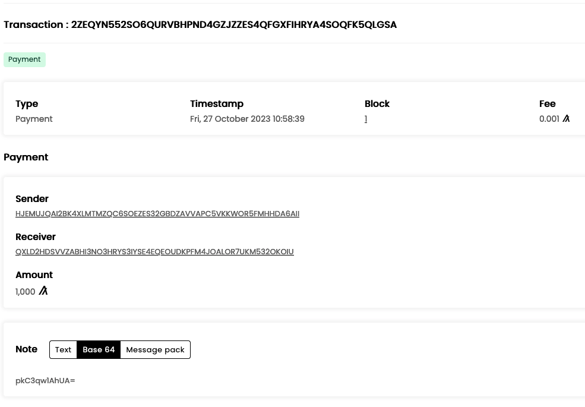

# Lab 2 - Experimenting with the JS SDK

To start this weeks Lab, we will be running some examples with the Algorand JS SDK - specifically, we'll be running the examples from last week in javascript browser and exploring them in the sandbox.

*The instructions for interacting with Algorand through the JS SDK takes pieces from and builds on the [official tutorial](https://developer.algorand.org/docs/sdks/javascript/)*

## Pre-requisites

**Required**:
- [AlgoKit](https://developer.algorand.org/algokit/) (Detailed instructions in week 1)
- [NodeJS](https://nodejs.org/en)
- Code Editor or IDE (we will be using the free [VS Code](https://code.visualstudio.com/))

## Preparation
Open your command line, and go into the folder that we created last week.

```bash
cd algohub-pyteal
```

Next we'll create a directory for our javascript project; enter the directory and  install the neccessary package.

```bash
mkdir week2-js-sdk && cd week2-js-sdk
# initialise the project
npm init -y
# install Algorand sdk
npm install algosdk --save
```

Now startup your sandbox node using AlgoKit.

We will also run a slightly modified version of the script to store the addresses in our environment variables.

```bash
counter=1
for addr in $(algokit goal account list | awk '{print $2}'); do
    export ACCT$counter=$addr
    echo "Set ACCT$counter=$addr"
    ((counter++))
done
```

This stores the addresses in our local environment. We are not going into the docker container so that we can easily interact between the Algorand docker container and our javascript.

Next, in our code editor we want to create a new file, gen_accounts.js in our directory and enter the following code:

```javascript
const algosdk = require("algosdk");

// now generate some addresses
const generatedAccount = algosdk.generateAccount();
  const passphrase = algosdk.secretKeyToMnemonic(generatedAccount.sk);
  console.log(`My address: ${generatedAccount.addr}`);
  console.log(`My passphrase: ${passphrase}`);

```
Now we can run that file from the command line, and generate our addresses

```bash
node gen_accounts.js
```

Running this should give you a response that looks like below;

```bash
❯ node gen_accounts.js
My address: QXLD2HDSVVZABHI3NO3HRYS3IYSE4EQEOUDKPFM4JOALOR7UKM532OKOIU
My passphrase: you should never share your passphrase which will appear here
```

Now we can save that account as an environment variable for easier use later. We will also fund the account from the existing accounts in our Algorand node.

```bash
export NEWADDRESS=QXLD2HDSVVZABHI3NO3HRYS3IYSE4EQEOUDKPFM4JOALOR7UKM532OKOIU
algokit goal clerk send -a 1000000000 -f $ACCT1 -t $NEWADDRESS
```

We'll then open our block explorer so we can watch what's going on:

```bash
algokit explore
```

If you click into the transactions tab, you should be able to see our earlier transaction;



[Transacting with JS](./Transaction_with_JS.md)

