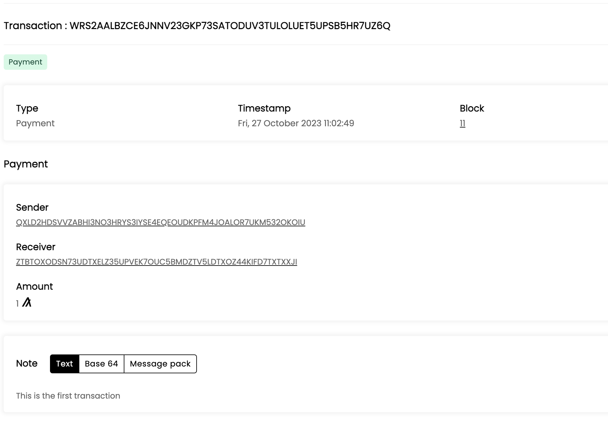
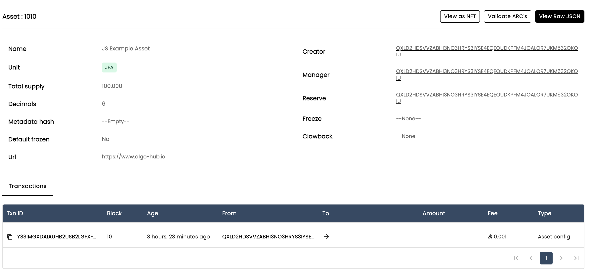

# Exploring Transactions with Algorand's JS 

Our work for this exercise will be in the javascript file `send_trans.js` in the folder `week2-js-sdk`.

As this file is pretty complex, we have also included the complete version in this week 2 folder.

## Transferring Algo's
Before we transfer algo's, we need to check out balance!

Let's start by saving your passphrase from the last step inside an environment variable `NEWADDRESS`.

```bash
export NEWADDRESS="your secret passphrase from earlier"
```

Make sure you put the `"`s around the passphrase, otherwise it wont save properly.

Next in the `send_trans.js` file, we have to import the AlgoSDK module and setup the server to connect to our devnet.

```javascript
const algosdk = require("algosdk");

// now we connect to the local server
const token = 'a'.repeat(64);
const server = 'http://localhost';
const port = 4002;
const client = new algosdk.Algodv2(token, server, port);
```

Then we create a function to check out balance, a call to the function using our environment variable that we just created.

```javascript
// Check your balance
async function getBalance(acct) {
    const acctInfo = await client.accountInformation(acct.addr).do();
    console.log(`Account balance: ${acctInfo.amount} microAlgos`);
}

// Get passphrase from environment variables
const pass = process.env.PASSPHRASE;
if (pass == undefined) {
    console.log("PASSPHRASE environment variable not set");
    process.exit(1);
}

// create account from passphrase
const acct = algosdk.mnemonicToSecretKey(pass);
getBalance(acct);
```

We store the get balance in a function so that we can use `await` and `async` against the client call.

When that runs, you will see something like this:

```bash
Account balance: 995996000 microAlgos
```

Now we'll create a function to send some algo's to one of the other addresses from the Algorand devnet (ACCT2).

```javascript
// build and send transactions
// here the input is the from account, the to address, the amount and note
async function sendPayment(acct, address2, amount, note) {
    const suggestedParams = await client.getTransactionParams().do();
    const ptxn = algosdk.makePaymentTxnWithSuggestedParamsFromObject({
    from: acct.addr,
    suggestedParams,
    to: address2,
    amount: amount,
    note: new Uint8Array(Buffer.from(note)),
    });

    // sign the transaction
    const signedTxn = ptxn.signTxn(acct.sk);

    // submit the transaction
    const { txId } = await client.sendRawTransaction(signedTxn).do();
    const result = await algosdk.waitForConfirmation(client, txId, 4);
    console.log(result);
    console.log(`Decoded Note: ${Buffer.from(result.txn.txn.note).toString()}`);
}

// We also need to add a check to get the ACCT2 address from the environment variable
// Get acct2 from environment variable
const acct2 = process.env.ACCT2;
if (acct2 == undefined) {
    console.log("ACCT2 environment variable not set");
    process.exit(1);
}


// Then later we call the function
// send payment
sendPayment(acct, acct2, 1000000, "This is the first transaction");

```

In the live class I will talk all of these through line-by-line, but we can see that we have the from account, the two account and a note to be added to the transaction. 

If we view the transaction in the explorer it looks like -


You can see from the image that the Algos amount is one, even though we sent `1000000`. This is because Algo's have a decimal length of 6, so by sending `1000000` we are sending 1 full Algo.

For this last part, we will be creating an asset.

```javascript
// Create an asset and print it's details
async function createAsset(acct, assetName, unitName, assetUrl, totalIssuance, decimals) {
  // create asset
  const suggestedParams = await client.getTransactionParams().do();
  const txn = algosdk.makeAssetCreateTxnWithSuggestedParamsFromObject({
    from: acct.addr,
    suggestedParams,
    defaultFrozen: false,
    unitName: unitName,
    assetName: assetName,
    manager: acct.addr,
    reserve: acct.addr,
    assetURL: assetUrl,
    total: totalIssuance,
    decimals: decimals,
  });

  const signedTxn = txn.signTxn(acct.sk);
  await client.sendRawTransaction(signedTxn).do();
  const result = await algosdk.waitForConfirmation(
    client,
    txn.txID().toString(),
    3
  );

  // get asset index from transaction results
  const assetIndex = result['asset-index'];
  console.log(`Asset ID created: ${assetIndex}`);
  

  // Print asset info for newly created asset
  const assetInfo = await client.getAssetByID(assetIndex).do();
  console.log(`Asset Name: ${assetInfo.params.name}`);
  console.log(`Asset Params: ${JSON.stringify(assetInfo.params)}`);

}

// later we have to call the function to create the asset
// These values can be whatever you want
const assetName = "JS Example Asset";
const unitName = "JEA";
const assetUrl = "https://www.algo-hub.io";
const totalIssuance = 100000000000;
const decimals = 6;
createAsset(acct, assetName, unitName, assetUrl, totalIssuance, decimals);

```

When that asset is created, we can see it on dappflow and it looks like -


Phew! We're nearly there thankfully!

The last thing we need to do is transfer our asset to someone.

To do this, we need the other person to opt-in to our asset.

As we have been working with `ACCT2`, we will send them some of our asset as well.

To do this, we need to go back to the command line and have `ACCT2` opt-in to our asset ... which we can see from the image is `1010`.

```bash
# Just as a reminder, to opt-in to an asset a user needs to send themselves a zero value transaction of that asset
# so for ACCT2 that looks like
algokit goal asset send --assetid 1010 -f $ACCT2 -t $ACCT2 --amount 0
```

Now that `ACCT2` has (hopefully) opted-in successfully, we need to send them some of our asset.

```javascript
// send asset to another account
async function sendAsset(acct, address2, assetIndex, amount) {
  // create transaction to send asset
  const suggestedParams = await client.getTransactionParams().do();
  const txn = algosdk.makeAssetTransferTxnWithSuggestedParamsFromObject({
    from: acct.addr,
    suggestedParams,
    to: address2,
    assetIndex: assetIndex,
    amount: amount,
  });

  const signedTxn = txn.signTxn(acct.sk);
  await client.sendRawTransaction(signedTxn).do();
  const result = await algosdk.waitForConfirmation(
    client,
    txn.txID().toString(),
    3
  );
  console.log('asset transfer successful for amount ', (result.txn.txn.aamt ? result.txn.txn.aamt : 0));

}

// later we need to call the function. 
// You may notice we call it twice - the first time we use our own address and a 0 value to opt-in to the asset
// send asset - first we opt in to the asset
sendAsset(acct, acct.addr, 1010, 0);

// send asset to address2
sendAsset(acct, acct2, 1010, 1000);
```

Congratulations! Now you have learned to interact with the Algorand devnet and send transactions from the JavaScript sdk.


