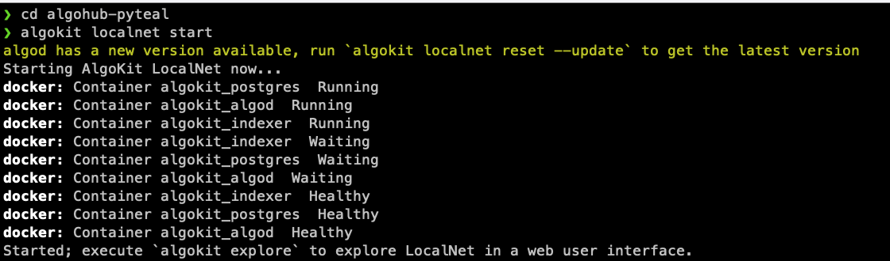
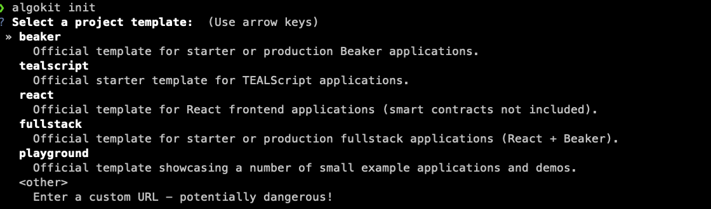
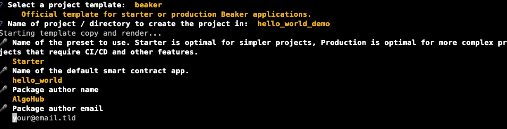
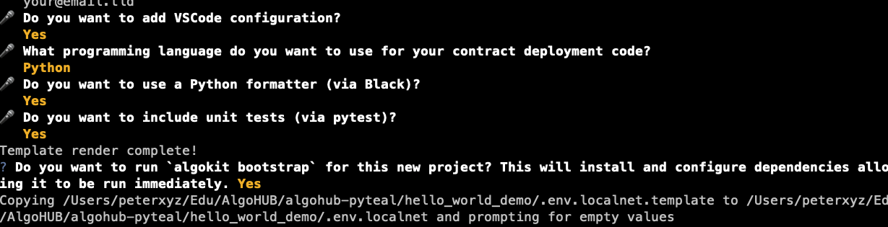
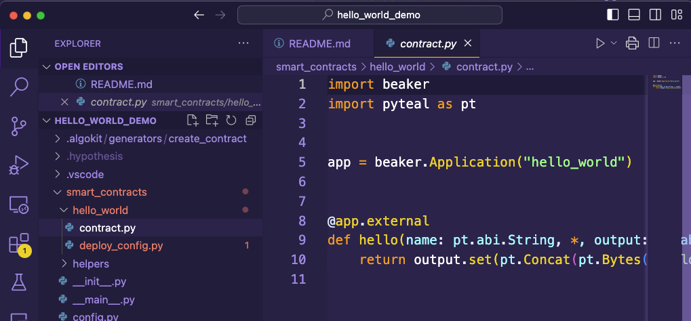
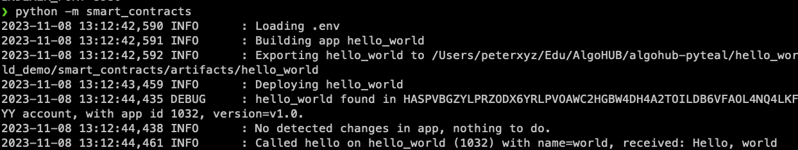

# Week 3 Part 1 - Creating and Deploying Smart Contracts with AlgoKit

Hi everyone! For this Lab, we are going to be using the environment we setup in Week 1. So if you haven't been through that exercise yet, you can find it [here](../../Week1/README.md).

In this tutorial, we are going to learn how to use AlgoKit to quickly build and deploy smart contracts.

## Pre-requisites

- AlgoKit tool (as completed in [Week 1](../../Week1/README.md))
- A code editor (for the tutorial, I will be using [VSCode](https://code.visualstudio.com/))

## Getting our environment ready
First, we need to make sure that we have our Algorand localnet environment up and ready. 

Let's enter into the directory we use for this course, for us it's `algohub-pyteal`, and start the localnet server.

```bash
cd algohub-pyteal
algokit localnet start
```
Your terminal should look something like the image below, if you receive an error it's possible you haven't started docker yet.



## Start a new AlgoKit project

Once that is done, we want to start a new algokit project. 

```bash
algokit init
```
This will bring up a screen asking to select a template; for this project we select the beaker template.



Set the name of the project, we'll use `hello_world_demo`.

Select `Starter` template.



Choose the default (Y) by pressing enter for `Do you want to add VSCode configuration`.

Select `Python` as the desired language, and press enter for the default (Y) for `Do you want to use a Python formatter (via Black)?`.

Press enter to select the default for `Do you want to include unit tests (via pytest)?` and press enter to run `algokit bootstrap` to load all the required modules.



If you have the `code` shortcut installed for vscode, once the process is finished it should open the project in a VsCode window.

Have a look through the code, specifically the folder `smart_contracts/hello_world` as that is where the smart contract file is.

.

Once you have familiarised yourself with the code, return to the terminal window we used earlier.

We are going to deploy the smart contract to our local devnet now.

```bash
# first change directory into the folder we created earlier
cd hello_world_demo

# we have to set the environment variables for the devnet
cp .env.localnet .env
```

The `.env` file that we just copied sets all of the evironment variables to deploy to the devnet, if you want to work with any other network you need to change this.

The devnet `.env` file:
```bash
# this file should contain environment variables specific to algokit localnet
ALGOD_TOKEN=aaaaaaaaaaaaaaaaaaaaaaaaaaaaaaaaaaaaaaaaaaaaaaaaaaaaaaaaaaaaaaaa
ALGOD_SERVER=http://localhost
ALGOD_PORT=4001
INDEXER_TOKEN=aaaaaaaaaaaaaaaaaaaaaaaaaaaaaaaaaaaaaaaaaaaaaaaaaaaaaaaaaaaaaaaa
INDEXER_SERVER=http://localhost
INDEXER_PORT=8980
```

To run the deploy code, we can use the following command:
```bash
python -m smart_contracts
```
This should deploy and test the smart contract, and produce an output like this:


You can see from the image that the smart contract is deployed, the app_id that it receives is displayed (`1032`), and then the `hello` function is called with the variable `name=world`.

We can also see the return value, `Hello, world`.

Phew! The example smart contract has been deployed, and has been tested.

We will go through more about how the testing part works in the next section ... but take a moment to pat yourself on the back for making it this far!

[Create and deploying a simple counter app](./deploy_counter.md)