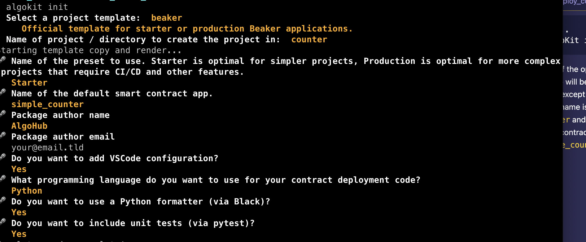
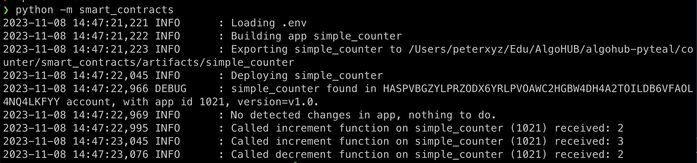

# Create and deploy a simple counter

For this section, we are going to be creating another beaker template with AlgoKit.

Assuming that you are continuing on from the prior exercise, we need to exit the directory before running `AlgoKit init` again.

```bash
cd ..
AlgoKit init
```

Most of the options we choose will be the same, except the folder name is `counter` and the smart contract name is `simple_counter`.

.

Now that's done, it's time to update the contract.

We can see that the same `hello_world` code has been added to the `contract.py` file.

It looks like this:
```python
import beaker
import pyteal as pt


app = beaker.Application("simple_counter")


@app.external
def hello(name: pt.abi.String, *, output: pt.abi.String) -> pt.Expr:
    return output.set(pt.Concat(pt.Bytes("Hello, "), name.get()))

```

We can see that our new smart contract name is there, but it still has the same boilerplate. 

For our simple counter, we need three things;
1. We need to set a global state
2. We need a function to add 1
3. We need a function to subtract 1

## Global state
Global state in Beaker is set by using a class, and we need the global state to have a counter that starts at zero.

 ```python
 class AppState:
    # set variable name
    counter_global = beaker.GlobalStateValue(
        # set type as uint
        stack_type=pt.TealType.uint64,
        # set default to 0
        default=pt.Int(0)
    )

```

Now that we have the state defined, we need to include it in our application initilisation.

```python
# we add the state parameter with the AppState class as the value
app = beaker.Application("simple_counter", state=AppState())

```

Now that state has been taken care of, we need to replace the `hello` function with ones for increasing and decreasing the count.

```python
# The @app.external states that this function call be called externally
@app.external
def increment_global(*, output: pt.abi.Uint64) -> pt.Expr:
    return pt.Seq(
        # here we get the counter_global item from the state, and set it to it's current value + 1
        app.state.counter_global.set(app.state.counter_global.get() + pt.Int(1)),
        # We now set the return value
        output.set(app.state.counter_global.get())
    )

@app.external
# This method reduces the count
def decrement_global(*, output: pt.abi.Uint64) -> pt.Expr:
    return pt.Seq(
        # save the state value counter_global as counter - 1
        app.state.counter_global.set(app.state.counter_global.get() - pt.Int(1)),
        # return the value
        output.set(app.state.counter_global.get())
    )

```

You can see the full contract [here](./example-contract.py).

Now that we have updated the contract, we would think that's all we need to do ... but if you recall from our `hello_world` example, there is a function to call the smart contract.

So we'll need to update that. For that we need to examine `deploy_config.py`.

The main part that we need to examine is at the very bottom.

```python
 # set the variable name to world
 name = "world"
 # call the hello function with name
    response = app_client.hello(name=name)
    # print the info returned
    logger.info(
        f"Called hello on {app_spec.contract.name} ({app_client.app_id}) "
        f"with name={name}, received: {response.return_value}"
    )
```

We can see that it calls the `hello` function, which we don't have anymore.

So we need to update it to support our new functions.

Also, we have two functions, `increment` that increases the counter and `decrement` that decreases it. So we should include enough test transactions to see how that works.

```python
   # Lets call the increment function
    response = app_client.increment_global()
    logger.info(
        f"Called increment function on {app_spec.contract.name} ({app_client.app_id}) "
        f"received: {response.return_value}"
    )
    # Let's call it again
    response = app_client.increment_global()
    logger.info(
        f"Called increment function on {app_spec.contract.name} ({app_client.app_id}) "
        f"received: {response.return_value}"
    )

    # now we'll call decrement function
    response = app_client.decrement_global()
    logger.info(
        f"Called decrement function on {app_spec.contract.name} ({app_client.app_id}) "
        f"received: {response.return_value}"
    )

```

Now save both of those, and it is time to return to the command line to test our new smart contract.

```bash
# enter the directory for our project
cd counter

# copy the localnet environment files
cp .env.localnet .env

# run the python script
python -m smart_contracts
```

Assuming that has worked successfully, your output should look like:



Great! Now we're done with Part 1!


