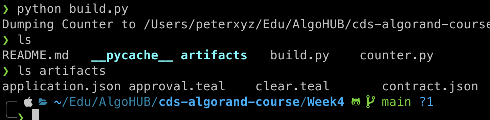
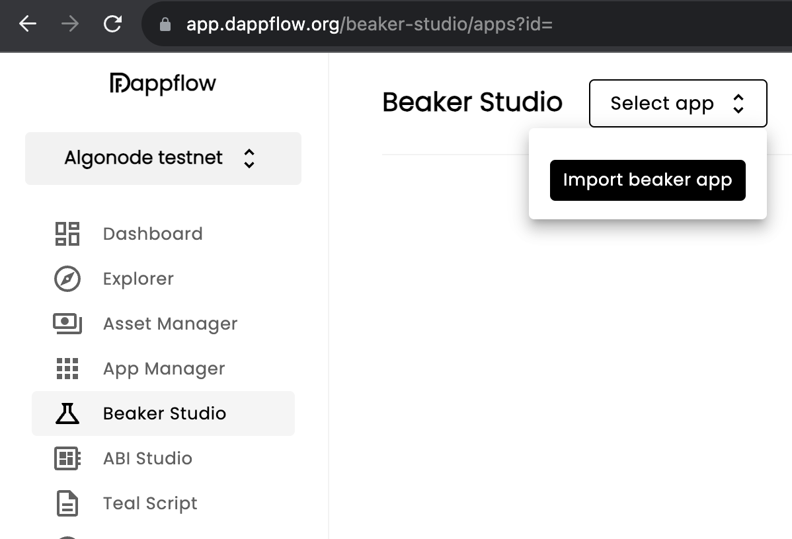
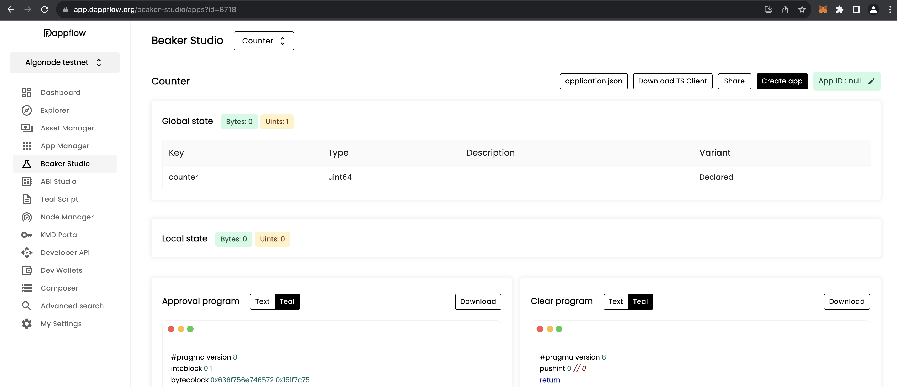
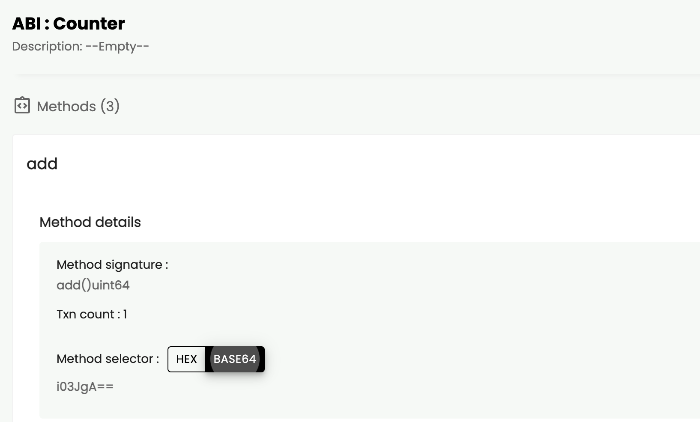
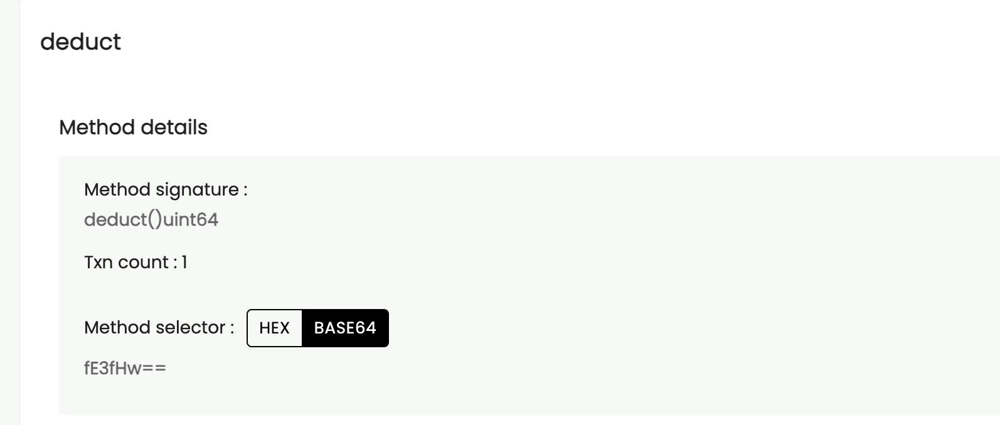
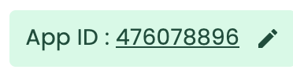
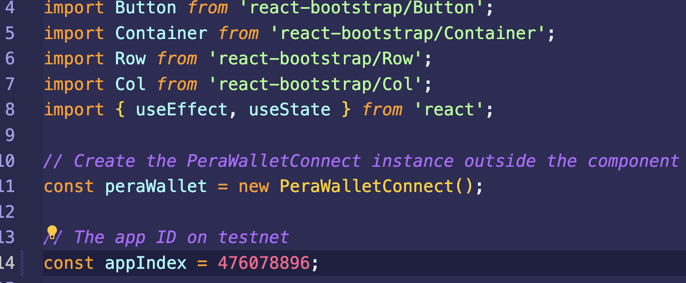
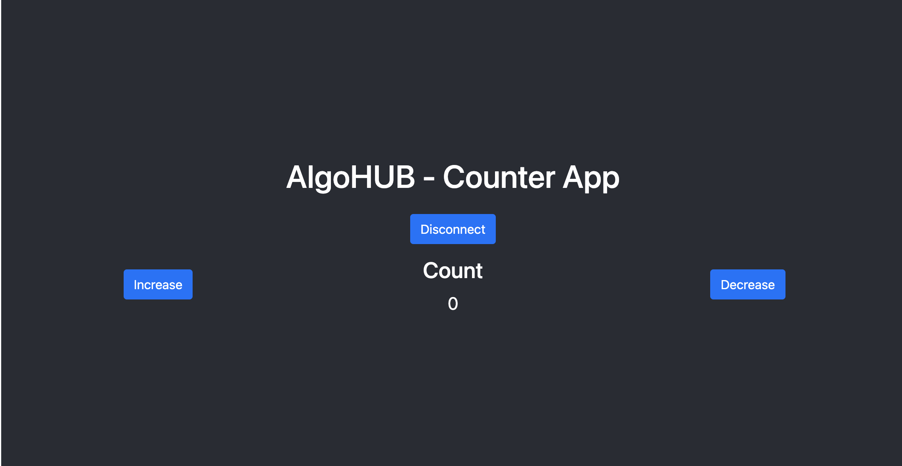

# Interact with a smart contract from the web

Hi everyone! Welcome to Week 4. The work we do in this lab directly builds off the previous, so please make sure that you have completed [Week 3](../Week3/README.md) before you get started.

In this tutorial, we are going to be deploy the smart contract we made in Week 3, and connecting it to a React front-end so we can use it from the web!

We'll then be making some changes to the Beaker application, then redeploy it to the Algorand testnet and update the interface to reflect the changes.

First, we need to make sure we have the necessary files for this exercise.

We'll download the counter-app template, and this repo (if you are just viewing this on the web).

```bash
# First we go to our directory for these classes
cd algohub-pyteal

# then we clone into the counter app (for later)
git clone https://github.com/Algo-Hub-io/counter-app.git

# next we clone into this course (only if you don't have it already downloaded)
git clone https://github.com/Algo-Hub-io/cds-algorand-course.git
```

Now that we have all the components we need, let's look at what we need to do;
1. Compile our contract again
2. Deploy it to testnet
3. Customise the counter-app

Once those items have been done, we can move onto the next phase.

The contract (and the file to compile it), are located in the same directory as this file. And the artifacts generated will be in the same set of folders too.

```bash
# assuming you are still in the algohub-pyteal directory
cd cds-algorand-course/Week4

python build.py
```

Once we have done that we can see that we have a new artifacts folder with the build files.



Then we need to open the DappFlow explorer, and sign in to testnet with out Pera Wallet.

```bash
algokit explore
```

Once you have connected your Pera Wallet to the testnet, go to Beaker Studio in Dapp Flow and click **import beaker app**.



Then we select the application.json file from the artifacts folder we just created.

It should look somewhat like the image below:


Click on the **create app** button in the top right corner and click create; you will have to sign a transaction in your Pera wallet app.

Next we need to scroll down to the **ABI Counter** section, expand the method functions and note the base64 reference for the function - shown in the image below.



We do the same for the deduct method:



and we'll also note the application ID in the top right corner:



The values that we have from these images (that you can also use) are:
- **Add Selector** - i03JgA==
- **Deduct Selector** - fE3fHw==
- **App Id** - 476078896

Now we have everything we need fill out the counter app template.

So let's open a new terminal and enter that directory.

```bash
cd counter-app
# then we install the necessary packages
npm install
# and open in our chosen code editor
code .
```

The file we need is `src/App.js`, and luckily for us it seems to already have the two selectors added.

So we just need to update the app id near the top of the `App.js` file.



Then return to the command line and run `'npm start`.

If a browser window doesn't open for you, you can go to `http://localhost:3000` in your browser of choice.

You should see a screen like this:


The button in the middle allows you to connect your wallet, and the increase and decrease will increase and decrease the counter.

For each button, you will need to approve the transaction in your Pera Wallet.

[Update the counter app with local storage](./updateCounter.md)